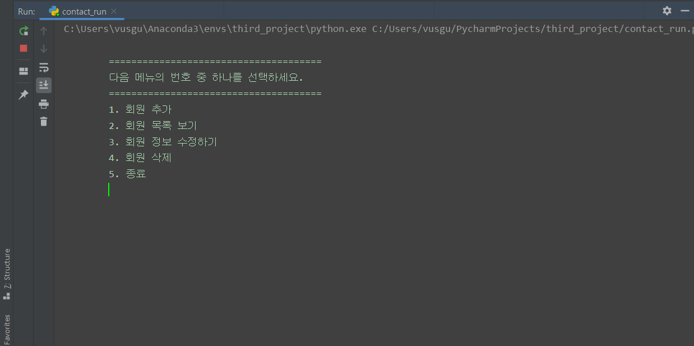
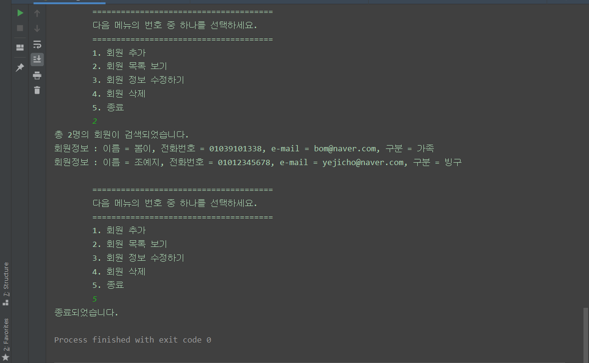

# 첫번째 개발 과제 - DB를 연동한 연락처 프로그램
## 1. 전체메뉴 출력

### 메뉴
- 회원 추가
- 회원 목록 보기
- 회원 정보 수정하기
- 회원 삭제
- 종료
---

## 2. 회원 추가
- 이름, 전화번호, 이메일, 구분을 넣어 회원을 추가할 수 있다.

### 예외 처리 
- 이름
    - 공백일 경우 예외 발생
    - 10자 이상일 경우 예외 발생

- 전화번호 
    - 숫자만 입력 가능
    - 7자리부터 12자리까지만 입력 가능

- 이메일
    - 이메일 정규식 포맷인 주소만 입력 가능

- 구분
    - 공백일 경우 예외 발생
    - 20자 이상일 경우 예외 발생
---

## 3. 회원 목록 보기

---

## 4. 회원 정보 수정하기

- 수정할 회원의 이름을 입력한다.
    - 해당하는 회원이 없을 경우 메인 메뉴로 돌아간다.

- 해당하는 회원의 이름이 중복될 경우 번호를 입력해 수정할 수 있다.
---

## 5. 회원 삭제

- 삭제할 회원의 이름으로 검색한다.
    - 해당하는 회원의 이름이 중복될 경우 번호를 입력해 삭제할 수 있다.
---

## 6. 프로그램 종료

- 종료 메시지가 출력되며 프로그램이 종료된다.